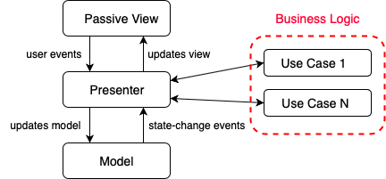

# iOS Clean MVP architecture example
This app demonstrates an architecture that I find useful for small to medium sized iOS apps. It is based on MVP but it extends it by borrowing some concepts from Uncle Bob's [Clean Architecture](https://blog.cleancoder.com/uncle-bob/2012/08/13/the-clean-architecture.html).

The architecture is based on **MVP (Model - View - Presenter)** in a **Passive View** variant. On top of that there is one significant modification inspired by **Clean Architecture** - Presenter focuses only on UI logic. All business logic should be done using **Use Cases** (aka Interactors) which are owned by Presenter.

Conceptually it looks like this:

### Rules
The descriptions are always abstract and can be interpreted in a number of ways. To make it more easily applicable here's some actionable rules that should be followed:

 * `UIViewController` is also considered part of `View`
 * `Presenter` and `View` should communicate using protocols.
 * Direct communication between `Model` and `View` is not allowed. It's `Presenter`'s job to setup `View` using data extracted from the `Model`. `View` cannot know anything about `Model`. `Model` cannot be passed to `View` as an argument.
 * `Presenter` should not import UIKit. All UI work needs to happen in `View`
 * `View` should not contain any logic. This includes UI logic. `View` should be as dumb as possible.
 * Use `Use Cases`, `Interactors` or other higher level abstractions for business logic. Don't put business logic into `Presenter`. 
 * `Presenter` owns `Use Cases`/`Interactors`
 

### Coordinator Pattern
Navigation in the app is done using the **[Coordinator Design Pattern](https://will.townsend.io/2016/an-ios-coordinator-pattern)** . This makes it easy to understand and modify navigation flows. It also breaks tight coupling between ViewControllers making it easy to reuse ViewControllers in a different context. (Typically View Controllers push other ViewControllers creating a hardcoded relationship between them. Coordinator breaks this relationship by acting as a middle man). Ideally all transitions between views should be done inside the Coordinators. This means assigning rootViewController, pushing, popping, presenting and dismissing UIViewControllers.

**What is a Coordinator?**

Coordinator is a piece of code responsible for transitions between ViewControllers. In a small app it can be just one object (e.g. AppCoordinator) which controls navigation of the whole app but typically it will be a better approach to have multiple Coordinators arranged in a hierarchical structure. For example - AppCoordinator which handles navigating to/from Features and child Coordinators for each Feature which handles navigation within this Feature.
Main benefit of using this approach is that all navigation code is in one place so you are sure you didn’t forget anything when you’re changing navigation flows. It also makes it easy to understand the navigation flow of the app because it is in one place. You don’t need to search the code of the whole app to find all places where view controllers are pushed on navigation stack. 
